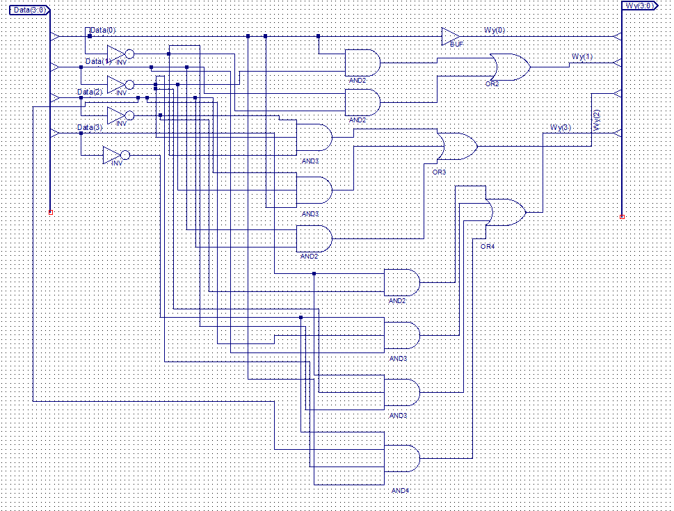
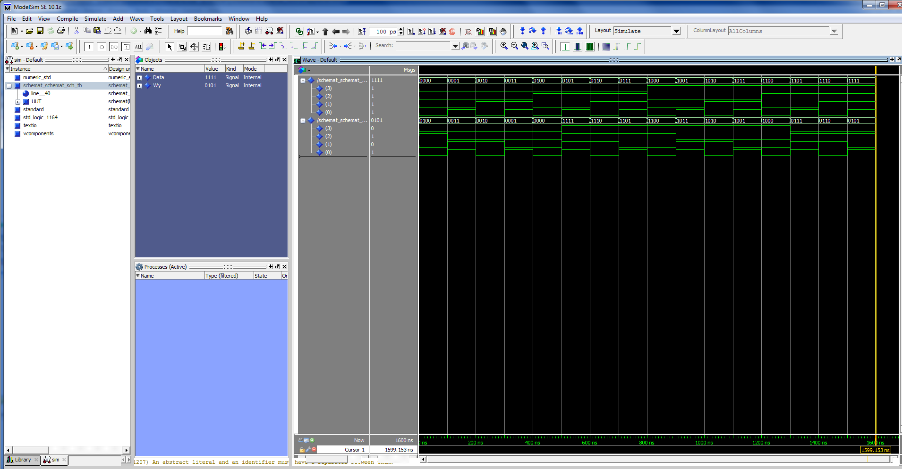

# Układy cyfrowe i systemy wbudowane 1 - sprawozdanie z zajęć nr 1

#### Termin zajęć:
16.10.2017

#### Autorzy:
* Wojciech Ormaniec, 226181
* Bartosz Rodziewicz, 226105

#### Prowadzący:
dr inż. Jarosław Sugier


## Treść zadania
Wykonać schemat, symulację i implementację na płytce ZL-9572 układu realizującego działanie `(4 - X) % 16 = Y`.

## Wykonanie schematu
### Tabelki prawdy
Zarówno wartości `X`, jak i `Y`, mieszczą się w przedziale (0,15), więc sygnał wejściowy i wyjściowy będzie 4-bitowy.

Bity sygnału wejściowego w tabelkach oznaczamy `K0 - K3`, a bity sygnału wyjściowego `W0 - W3`.

Dla każdego bitu sygnału wejściowego przygotowaliśmy tabelkę Karnaugha.

#### Bit W0

| K3K2 \ K1K0 | 00 | 01 | 11 | 10 |
| :-: | :-: | :-: | :-: | :-: |
| **00** | 0 | 1 | 1 | 0 |
| **01** | 0 | 1 | 1 | 0 |
| **11** | 0 | 1 | 1 | 0 |
| **10** | 0 | 1 | 1 | 0 |

Daje nam to równanie:


#### Bit W1

| K3K2 \ K1K0 | 00 | 01 | 11 | 10 |
| :-: | :-: | :-: | :-: | :-: |
| **00** | 0 | 1 | 0 | 1 |
| **01** | 0 | 1 | 0 | 1 |
| **11** | 0 | 1 | 0 | 1 |
| **10** | 0 | 1 | 0 | 1 |

Daje nam to równanie:


#### Bit W2

| K3K2 \ K1K0 | 00 | 01 | 11 | 10 |
| :-: | :-: | :-: | :-: | :-: |
| **00** | 1 | 0 | 0 | 0 |
| **01** | 0 | 1 | 1 | 1 |
| **11** | 0 | 1 | 1 | 1 |
| **10** | 1 | 0 | 0 | 0 |

Daje nam to równanie:


#### Bit W3

| K3K2 \ K1K0 | 00 | 01 | 11 | 10 |
| :-: | :-: | :-: | :-: | :-: |
| **00** | 0 | 0 | 0 | 0 |
| **01** | 0 | 1 | 1 | 1 |
| **11** | 1 | 0 | 0 | 0 |
| **10** | 1 | 1 | 1 | 1 |

Daje nam to równanie:


### Schemat graficzny

Mając powyższe równania stworzyliśmy poniższy schemat.

Po ich stworzeniu uświadomiliśmy sobie, że nie uprościliśmy ich całkowicie, jednak tak już zostawiliśmy.

Schemat wyszedł bardzo nieczytelnie, ponieważ nie znaliśmy całkowitej funkcjonalności ISE (jak np. bramki z zanegowanymi sygnałami wejściowymi).



## Symulacja układu
### Plik VHDL

W pliku VHDL do naszej symulacji zdefiniowaliśmy wektory sygnału wejściowego i wyjściowego:

```
COMPONENT schemat
PORT( Data	:	IN	STD_LOGIC_VECTOR (3 DOWNTO 0);
       Wy	:	OUT	STD_LOGIC_VECTOR (3 DOWNTO 0));
END COMPONENT;

SIGNAL Data	:	STD_LOGIC_VECTOR (3 DOWNTO 0);
SIGNAL Wy	:	STD_LOGIC_VECTOR (3 DOWNTO 0);
```

Przypisaliśmy wektory do odpowiednich portów:

```
UUT: schemat PORT MAP(
 Data => Data,
 Wy => Wy
);
```

Oraz napisaliśmy zmianę sygnału wejściowego w czasie (jedna linijka kodu):
```
Data <= X"0", X"1" after 100ns, X"2" after 200ns, X"3" after 300ns,
X"4" after 400ns, X"5" after 500ns, X"6" after 600ns, X"7" after 700ns,
X"8" after 800ns, X"9" after 900ns, X"A" after 1000ns, X"B" after 1100ns,
X"C" after 1200ns, X"D" after 1300ns, X"E" after 1400ns, X"F" after 1500ns;
```

### Symulacja behawioralna

Tak przygotowaną symulację VHDL uruchomiliśmy w trybie symulacji behawioralnej:



### Symulacja post-fit

Następnie uruchomiliśmy symulację typu post-fit:


Obie symulacje przeszły poprawnie i wykazały, że stworzony przez nas schemat jest poprawny, więc przeszliśmy do implementacji na płytce.
