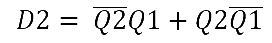
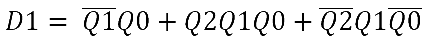
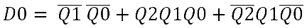
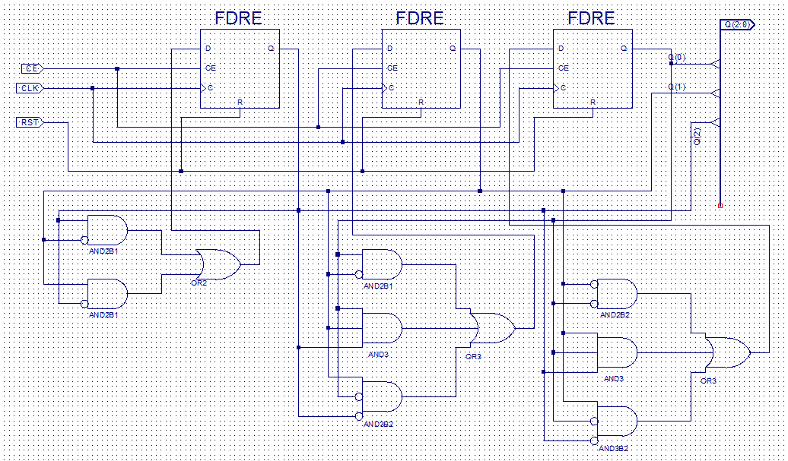
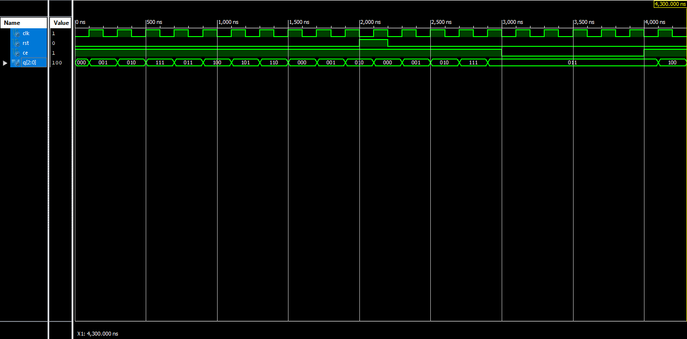
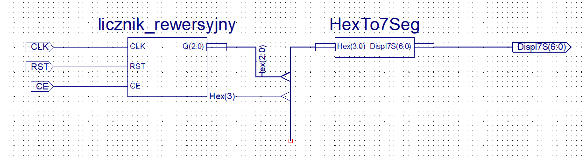
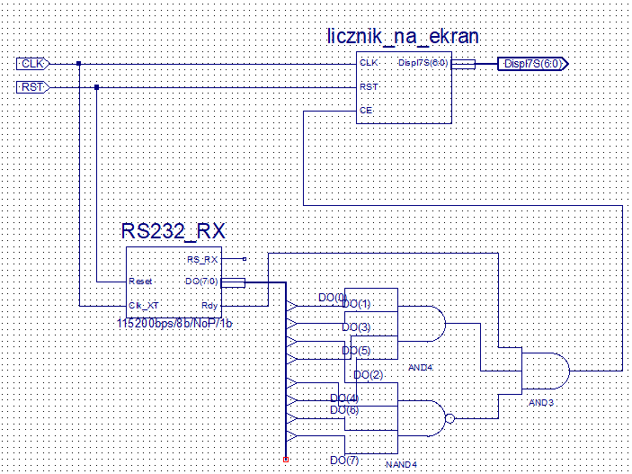

# Układy cyfrowe i systemy wbudowane 1 - sprawozdanie z zajęć nr 2

#### Termin zajęć:
13.11.2017

#### Autorzy:
* Wojciech Ormaniec, 226181
* Bartosz Rodziewicz, 226105

#### Prowadzący:
dr inż. Jarosław Sugier


## Schemat zajęć
Zajęcia były podzielone na wykonanie trzech, zależnych od siebie zadań.
### Zadanie pierwsze
Zadanie pierwsze polegało na zamodelowaniu, zasymulowaniu i implementacji schematu realizującego licznik asynchroniczny odliczający '0, 1, 2, 7, 3, 4, 5, 6, 0, ...'.
### Zadanie drugie
Drugim zadaniem było wykorzystanie stworzonego w poprzednim zadaniu licznika i gotowego układu obsługującego wyświetlacz celem wyświetlenia licznika na wyświetlaczu.
### Zadanie trzecie
Trzecie zadanie polegało na przerobieniu stworzonego w poprzednim zadaniu układu tak by wykorzystując układ obsługujący połączenie z komputerem zaprogramować licznik tak by inkrementował się w momencie otrzymania z komputera znaku '+'.

## Realizacja zadania pierwszego
### Wykonanie schematu
Licznik nasz przyjmuje wartości 0-7, więc sygnał wyjściowy mieści się na 3 bitach.

Do wykonania takiego układu potrzebowaliśmy przerzutników, prowadzący zasugerował użycie przerzutników typu D.

Jako, że sygnał wyjściowy jest 3 bitowy potrzebowaliśmy użyć 3 przerzutników.
#### Tabelki prawdy
Najpierw wykonaliśmy tabelkę zmian przerzutnika.

| t | t + 1 | |
| :-: |  :-: |  :-: |
| **Q2 Q1 Q0** | **Q2 Q1 Q0** | **D2 D1 D0** |
| 000 | 001 | 001 |
| 001 | 010 | 010 |
| 010 | 111 | 111 |
| 011 | 100 | 100 |
| 100 | 101 | 101 |
| 101 | 110 | 110 |
| 110 | 000 | 000 |
| 111 | 011 | 011 |

`Q0 - Q2` oznaczają stany przerzutnika, `D2 - D0` oznaczają wyjście D konkretnego przerzutnika w chwili t.

Dla każdego przerzutnika rozpisaliśmy tabelkę Karnaugha.

##### Przerzutnik D2

| Q2 \ Q1Q0 | 00 | 01 | 11 | 10 |
| :-: | :-: | :-: | :-: | :-: |
| **0** | 0 | 0 | 1 | 1 |
| **1** | 1 | 1 | 0 | 0 |

Daje nam to równanie:



##### Przerzutnik D1

| Q2 \ Q1Q0 | 00 | 01 | 11 | 10 |
| :-: | :-: | :-: | :-: | :-: |
| **0** | 0 | 1 | 0 | 1 |
| **1** | 0 | 1 | 1 | 0 |

Daje nam to równanie:



##### Przerzutnik D0

| Q2 \ Q1Q0 | 00 | 01 | 11 | 10 |
| :-: | :-: | :-: | :-: | :-: |
| **0** | 1 | 0 | 0 | 1 |
| **1** | 1 | 0 | 1 | 0 |

Daje nam to równanie:



### Schemat graficzny

Mając powyższe równania stworzyliśmy poniższy schemat.



### Symulacja układu
#### Plik VHDL
Do przeprowadzenia symulacji potrzebowaliśmy zdefiniować początkowe wartości sygnałów wejściowych:
```
SIGNAL CLK	:	STD_LOGIC :='0';
SIGNAL RST	:	STD_LOGIC :='0';
SIGNAL CE	:	STD_LOGIC :='1';
```
Oraz zaprogramować ich działanie (zmianę).

Programowanie zegara zostało wykonane jako:
```
CLK <= not CLK after 100 ns;
```
Celem przetestowania działania CE (clock enable) i RST (reset) zapisaliśmy dwie linijki:
```
RST <= '1' after 2000 ns, '0' after 2200 ns;
CE <= '0' after 3000 ns, '1' after 4000 ns;
```

#### Symulacja behawioralna

Tak przygotowaną symulację VHDL uruchomiliśmy w trybie symulacji behawioralnej:



#### Symulacja post-fit

W trakcie zajęć uruchomiliśmy symulację post-fit, jednak w domu przy próbie ponownego jej uruchomienia pojawiał się błąd, który uniemożliwił nam przeprowadzenie jej.

### Implementacja na zestawie
#### Przygotowanie pliku .ucf

Aby implementacja była możliwa musieliśmy przypisać nasze sygnały wejściowe i wyjściowe do fizycznych elementów zestawu.

Sygnały wejściowe zostały przypisane do klawiszy:

```
# Keys
NET "CE" LOC = "P42";
(...)
NET "RST" LOC = "P39";  # GSR
```
A zegar do:
```
# Clocks
NET "CLK" LOC = "P7" | BUFG = CLK | PERIOD = 5ms HIGH 50%;
```

Sygnał wyjściowy został przypisany do diod LED:
```
# LEDS
NET "Q(0)"  LOC = "P35";
NET "Q(1)"  LOC = "P29";
NET "Q(2)"  LOC = "P33";
```

#### Właściwa implementacja

Po przygotowaniu pliku .ucf wykonaliśmy właściwe programowanie układu. Po zaprogramowaniu układ działał, co zostało zaprezentowane prowadzącemu.

## Realizacja zadania drugiego

Drugie zadanie polegało na 'skompilowaniu' stworzonego wyżej układu do symbolu schematycznego (schematic symbol) i wykorzystaniu go wraz z drugim symbolem (pobranym z internetu) obsługującym wyświetlacz.

### Schemat

Wykorzystanie przygotowanego wcześniej symbolu wraz z HexTo7Seg nie wymagało dużo pracy i tak prezentuje się stworzony przez nas schemat:



### Symulacja

Do tego układu nie wykonywaliśmy symulacji.

### Implementacja

W celu implementacji musieliśmy dokonać drobnej zmiany w pliku .ucf.

Sygnał Q(2:0) został odłączony od diod LED, a sygnał Displ7S został podłączony pod wyświetlacz:
```
# DISPL. 7-SEG
(...)
NET "Displ7S<0>" LOC = "P12";	# Seg. A; shared with LED<10>
NET "Displ7S<1>" LOC = "P13";	# Seg. B; shared with LED<8>
NET "Displ7S<2>" LOC = "P22";	# Seg. C; shared with LED<12>
NET "Displ7S<3>" LOC = "P19";	# Seg. D; shared with LED<14>
NET "Displ7S<4>" LOC = "P14";	# Seg. E; shared with LED<15>
NET "Displ7S<5>" LOC = "P11";	# Seg. F; shared with LED<9>
NET "Displ7S<6>" LOC = "P20";	# Seg. G; shared with LED<13>
```

Po tej zmianie schemat został zaprogramowany na płytce i układ działał, co zostało zaprezentowane prowadzącemu.

## Realizacja zadania trzeciego

Tego zadania nie zdążyliśmy zrealizować z powodu niewystarczającej ilości czasu.

### Schemat

Znak '+' ma kod `43`, czyli `00101011` binarnie.

Wykorzystując tą informacje za pomocą bramek ustawiliśmy aby inkrementacja licznika następowała tylko gdy taki kod zostanie odebrany.

Z uwagi na małą ilość czasu i niedokładne zapoznanie się z dokumentacją błędnie pozostawiliśmy wyjście RS_RX wolnym.

Stworzony przez nas schemat prezentuje się następująco:



## Podsumowanie

Dwa pierwsze zadania zrealizowaliśmy w całości i poprawnie, co potwierdza poprawna implementacja na płytce.

Trzeciego zadania nie skończyliśmy z uwagi na małą ilość pozostałego czasu.
