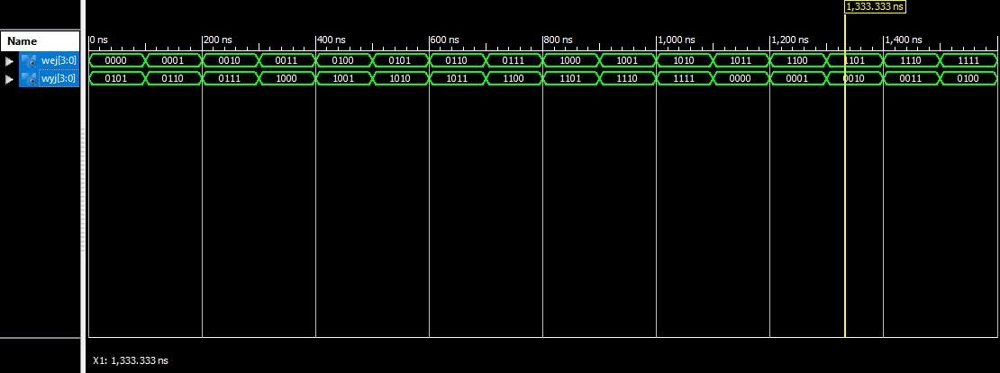
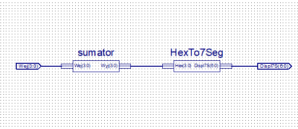
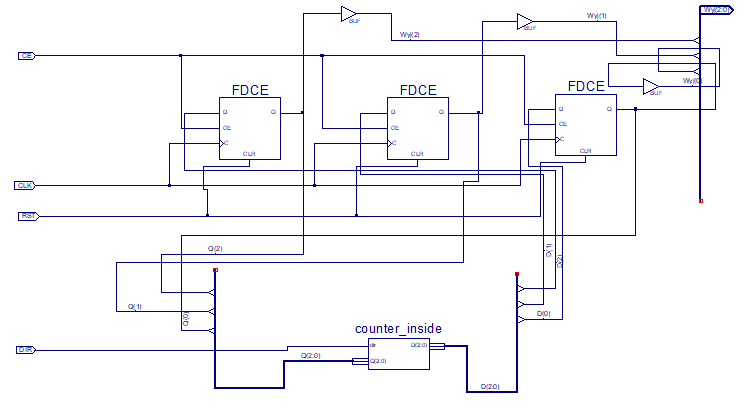

# Układy cyfrowe i systemy wbudowane 1 - sprawozdanie z zajęć nr 3

#### Termin zajęć:
27.11.2017

#### Autorzy:
* Wojciech Ormaniec, 226181
* Bartosz Rodziewicz, 226105

#### Prowadzący:
dr inż. Jarosław Sugier


## Schemat zajęć
Zajęcia były podzielone na wykonanie dwóch niezależnych zadań. Różnicą od poprzednich było to, że nie korzystaliśmy już ze schematów, tylko pisaliśmy kod VHDL.
### Zadanie pierwsze
Zadanie pierwsze polegało na zamodelowaniu, zasymulowaniu i implementacji układu realizującego dodawanie X+5 i wyświetleniu wyniku na ekranie LCD.
### Zadanie drugie
Realizacja ukłądu symulującego zachowanie licznika asynchronicznego dwukierunkowego odliczjącego '0, 2, 3, 4, 5, 1, 6, 7, 0, ...'.

## Realizacja zadania pierwszego
### Napisanie kodu VHDL
Najpierw chcieliśmy podejść do tego w sposób najbardziej oczywisty - do sygnału wejściowego dodać 0b101 (5) i przekierować to na sygnał wyściowy.

Po wielu próbah i zastanawianiu się jak to napisać naszą wstępną koncepcję poddaliśmy się i zdecydowaliśmy się na wykorzystanie `with ... select`.

#### Nasz kod
##### Definicja wejść i wyjść
```
PORT( Wej   :	IN	std_logic_vector(3 downto 0);
       Wyj	:	OUT	std_logic_vector(3 downto 0));
```
##### Zachowanie układu
```
with Wej select
      Wyj <= X"5" when X"0",
             X"6" when X"1",
             X"7" when X"2",
             X"8" when X"3",
             X"9" when X"4",
             X"A" when X"5",
             X"B" when X"6",
             X"C" when X"7",
             X"D" when X"8",
             X"E" when X"9",
             X"F" when X"A",
             X"0" when X"B",
             X"1" when X"C",
             X"2" when X"D",
             X"3" when X"E",
             X"4" when others;
```

### Symulacja

Do wykonania symulacji napisaliśmy bardzo prosty kod:
```
Wej <= X"0", X"1" after 100ns, X"2" after 200ns, X"3" after 300ns,
X"4" after 400ns, X"5" after 500ns, X"6" after 600ns, X"7" after 700ns,
X"8" after 800ns, X"9" after 900ns, X"A" after 1000ns, X"B" after 1100ns,
X"C" after 1200ns, X"D" after 1300ns, X"E" after 1400ns, X"F" after 1500ns;
```



### Podłączenie ekranu LCD (schemat)

Aby wyświetlić wynik na ekranie LCD skompilowaliśmy powyższy "sumator" do symbolu schematycznego (schematic symbol) i podłączyliśmy go za pomocą schematu do HexTo7Seg.



### Przygotowanie pliku .ucf

Aby zaimplementować ten układ na płytce musieliśmy przygotować plik `.ucf`, praktycznie taki sam jak na poprzednich zajęciach.

```
# Keys
NET "Wej(0)" LOC = "P42";
NET "Wej(1)" LOC = "P40";
NET "Wej(2)" LOC = "P43";
NET "Wej(3)" LOC = "P38";
```

```
# DISPL. 7-SEG
(...)
NET "Displ7S<0>" LOC = "P12";	# Seg. A; shared with LED<10>
NET "Displ7S<1>" LOC = "P13";	# Seg. B; shared with LED<8>
NET "Displ7S<2>" LOC = "P22";	# Seg. C; shared with LED<12>
NET "Displ7S<3>" LOC = "P19";	# Seg. D; shared with LED<14>
NET "Displ7S<4>" LOC = "P14";	# Seg. E; shared with LED<15>
NET "Displ7S<5>" LOC = "P11";	# Seg. F; shared with LED<9>
NET "Displ7S<6>" LOC = "P20";	# Seg. G; shared with LED<13>
```

### Właściwa implementacja
Po przygotowaniu pliku .ucf wykonaliśmy właściwe programowanie układu. Po zaprogramowaniu układ działał, co zostało zaprezentowane prowadzącemu.

## Realizacja zadania drugiego
_W tym zadaniu źle zrozumieliśmy treść i wydawało się nam, że należy przygotować w VHDL układ decydujący jak mają następować zmiany na przeżutnikach i podłączyć go na schemacie do przeżutników._

### Przygotowanie układu w VHDL

Zdecydowaliśmy się na takie samo rozwiązanie jak w pierwszym zadaniu i nasz kod wygląda w ten sposób.

```
entity counter_inside is
   PORT(  Q   :	IN	std_logic_vector(2 downto 0);
          dir :   IN std_logic;
          D	  :	OUT	std_logic_vector(2 downto 0));

	variable X : bit_vector(3 downto 0) := "0000";
end counter_inside;

architecture Behavioral of counter_inside is
begin
   --02345167
   X <= dir & Q;
   with X select
      D <= "000" when "1111",
           "010" when "1000",
           "011" when "1010",
           "100" when "1011",
           "101" when "1100",
           "001" when "1101",
           "110" when "1001",
           "111" when "1110",
           "111" when "0000",
           "000" when "0010",
           "010" when "0011",
           "011" when "0100",
           "100" when "0101",
           "101" when "0001",
           "001" when "0110",
           "110" when others;

end Behavioral;
```

### Podłączenie do schematu
Taką skompilowaną skrzynkę podłączyliśmy na schemacie do przerzutników.



### Symulacja
Do przeprowadenia symulacji przygotowaliśmy taki test7
```
SIGNAL DIR	:	STD_LOGIC :='0';
SIGNAL CLK	:	STD_LOGIC :='0';
SIGNAL RST	:	STD_LOGIC :='0';
SIGNAL CE	:	STD_LOGIC :='1';
SIGNAL Q	:	STD_LOGIC_VECTOR (2 DOWNTO 0);
```

```
CLK <= not CLK after 100 ns;
RST <= '1' after 2000 ns, '0' after 2200 ns, '1' after 8000 ns, '0' after 8200 ns;
CE <= '0' after 3000 ns, '1' after 4000 ns, '0' after 9000 ns, '1' after 10000 ns;

DIR <= '1' after 6000ns;
```

W momencie próby uruchomienia symulacji zobaczyliśmy, że nasz podsawowy układ jest błędny i mimo prób nie byliśmy w stanie tego poprawić. Gdy dowiedzieliśmy się, że i tak mieliśmy zrobić coś innego zostawiliśmy próby wyjaśnienia przyczyny błędu.

## Podsumowanie
Zadanie pierwsze zostało zrealizowane poprawnie, jednak drugie z uwagi na złe zrozumienie polecenia nam nie wyszło.
