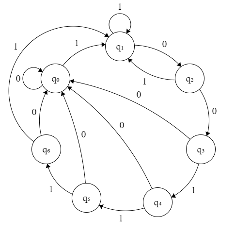
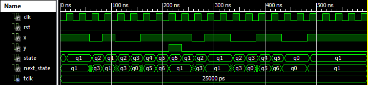
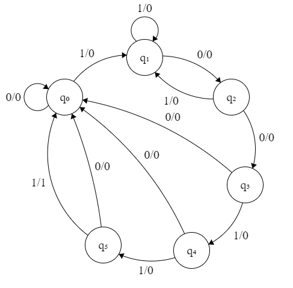
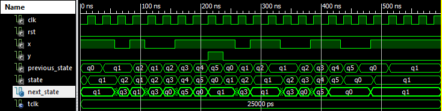

# Układy cyfrowe i systemy wbudowane 1 - sprawozdanie z zajęć nr 4

#### Termin zajęć:
11.12.2017

#### Autorzy:
* Wojciech Ormaniec, 226181
* Bartosz Rodziewicz, 226105

#### Prowadzący:
dr inż. Jarosław Sugier

## Schemat zajęć
W trakcie zajęć do wykonania mieliśmy jedno zadanie w dwóch wersjach.

### Treść zadania
Detektor sekwencji 100111 w formie automatu:
1. Moore'a
2. Mealy'ego

## Realizacja zadania w formie automatu Moore'a
### Graf



Rozwiązywanie zadania rozpoczęliśmy od przygotowania grafu przejść stanów w zależności od bitu wejściowego.

Zaprojektowany przez nas automat posiada:
* alfabet wejściowy: 0, 1
* stany wewnętrzne: q0, q1, q2, q3, q4, q5, q6  
_gdzie q0 jest stanem początkowym, a q6 stanem końcowym_
* alfabet wyjściowy: 0, 1
* funkcja przejść: _na grafie_
* funkcja wyjścia: y = 1, gdy q6; w innych stanach y = 0

### Kod VHDL wg. szablonu
Następnym etapem było przygotowania kodu bazując na gotowym szablonie.
Skończony kod, przygotowany do naszego automatu:

```
process_1 : process(Clk)
begin
  if rising_edge(Clk) then
    if Rst = '1' then
      state <= q0;
    else
      state <= next_state;
    end if;
  end if;
end process process_1;

process_2 : process(state,X)
begin
  next_state <= state;

  case state is
    when q0 =>
      if X = '1' then next_state <= q1;
      else next_state <= q0;
      end if;
    when q1 =>
      if X = '0' then next_state <= q2;
      else next_state <= q1;
      end if;
    when q2 =>
      if X = '0' then next_state <= q3;
      else next_state <= q1;
      end if;
    when q3 =>
      if X = '1' then next_state <= q4;
      else next_state <= q0;
      end if;
    when q4 =>
      if X = '1' then next_state <= q5;
      else next_state <= q0;
      end if;
    when q5 =>
      if X = '1' then next_state <= q6;
      else next_state <= q0;
      end if;
    when q6 =>
      if X = '1' then next_state <= q1;
      else next_state <= q0;
      end if;
  end case;
end process process_2;

output : process(state)
begin
  case state is
    when q0 => Y <= '0';
    when q1 => Y <= '0';
    when q2 => Y <= '0';
    when q3 => Y <= '0';
    when q4 => Y <= '0';
    when q5 => Y <= '0';
    when q6 => Y <= '1';
  end case;
end process output;


```

### Symulacja
Napisanie kodu symulacji, było jednym z cięższych części tego zadania.

Było kilka wytycznych jak ma on wyglądać:
* testowy ciąg znaków miał być tablicą 21 bitów w formacie: \*\*\*abcdef\*\*\*abcde**f'**\*\*\*
* przypisania sygnału X miały odbywać się w pętli, z jawnym zastosowaniem `wait`, tak aby zmiana wartości X, następowała 5ns przed zboczem rosnącym.
* częstotliwość zegara miała wynosić 40MHz.
* na symulacji miał być widoczny sygnał `state`.

#### Kod symulacyjny

```
(...)

--Inputs
signal Clk : std_logic := '0';
signal Rst : std_logic := '0';
signal X : std_logic := '1';

(...)

--Clock period definitions
constant Tclk : TIME := 1 us / 40; --MHz

(...)

process
   variable arrBytes : std_logic_vector ( 0 to 20 )
   := "110100111101100110011"; --jedna linijka
begin
   for i in arrBytes'RANGE loop
      wait for 7.5 ns;
      X <= arrBytes(i);
      wait for 17.5 ns;
   end loop;
   wait; --forever
end process;

(...)
```

#### Efekt symulacji
Sekwencja, której użyliśmy do symulacji: 110**100111**101**100110**011



## Realizacja zadania w formie automatu Mealy'ego
### Graf



Zaprojektowany przez nas automat posiada:
* alfabet wejściowy: 0, 1
* stany wewnętrzne: q0, q1, q2, q3, q4, q5  
_gdzie q0 jest stanem początkowym_
* alfabet wyjściowy: 0, 1
* funkcja przejść: _na grafie_
* funkcja wyjścia:  _na grafie - 0/0 przy przejściu oznacza wartość x=0/y=0_

### Kod VHDL wg. szablonu
Przerobienie kodu na symulacje automatu Mealy'ego zajęło nam spore trudności i w tym miejscu zatrzymaliśmy się na zajęciach.
W domu dokańczając zadanie doszliśmy do takiego rozwiązania:
* Ilość stanów oczywiście uległa pomniejszeniu o jeden
* Byliśmy zmuszeni dodać trzeci sygnał typu stanu - previous_state
* Zachowanie dla q5 uległo zmianie na stałe przejście na q0
* Część odpowiedzialna za generowanie sygnału y wygląda tak:
```
y <= '1' when state = q0 and previous_state = q5 and X = '1'
else '0';
```

### Symulacja
Wykonanie symulacji dla tej części tak na prawdę polegało na przekopiowaniu kodu napisanego dla poprzedniej części.

Kod nie uległ żadnej zmianie, więc nie ma potrzeby wklejać go tutaj jeszcze raz.

#### Efekt symulacji


## Porównanie pracy automatów Moore'a i Mealy'ego
Nie byliśmy w stanie zauważyć różnic w pracy obu automatów odbiegających od tego co wprost wynika z definicji, czyli, że automat nie wymaga dodatkowego/ych, specjalnego/ych stanu/ów kończącego/ych.

## Programowanie sprzętu
Jako, że nie dokończyliśmy automatu Mealy'ego w trakcie zajęć, nie zaczęliśmy nawet programowania sprzętu.

## Wnioski
Automat Mealy'ego mimo, że uproszczający schemat, jest o wiele trudniejszy w wykorzystaniu.
