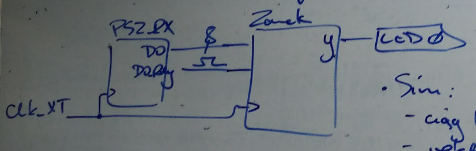
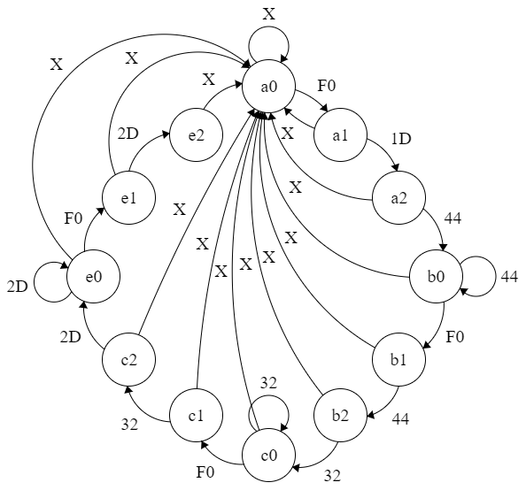
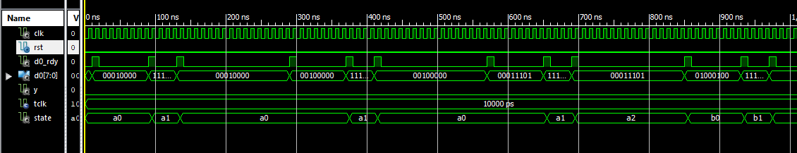
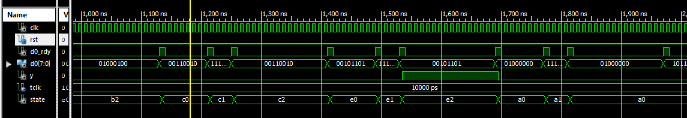
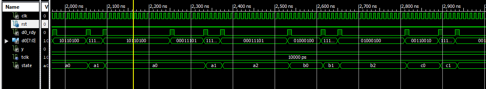
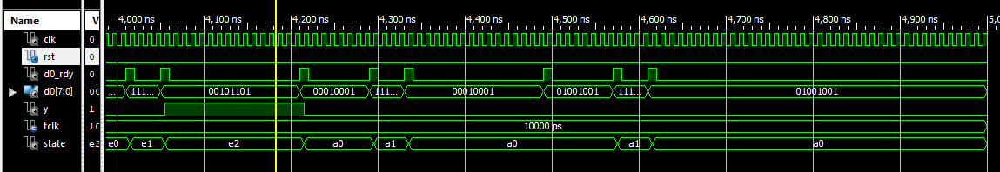
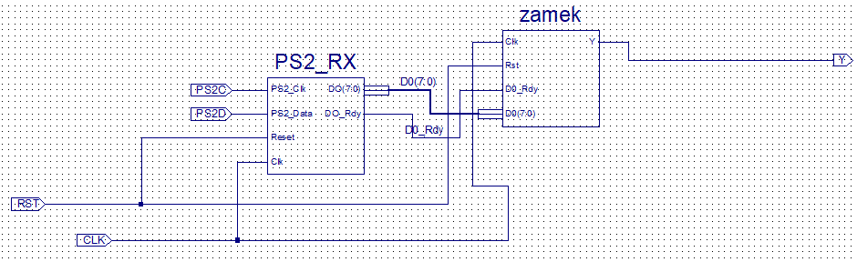

# Układy cyfrowe i systemy wbudowane 1 - sprawozdanie z zajęć nr 5

#### Termin zajęć:
03.01.2018

#### Autorzy:
* Wojciech Ormaniec, 226181
* Bartosz Rodziewicz, 226105

#### Prowadzący:
dr inż. Jarosław Sugier

## Schemat zajęć - treść zadania
W trakcie zajęć do realizacji było jedno zadanie - automat pełniący rolę zamka szyfrowego odblokowujący się po podaniu kombinacji złożonej z czterech liter stanowiących nasze inicjały. Litery miały być wpisywane na klawiaturze do obsługi której mieliśmy wykorzystać moduł PS2_RX.

## Realizacja zadania
### Wstępny plan zadania


Pierwszym etapem zadania było zrozumienie działania modułu PS2_RX. Moduł ten na wyjściu D0 podaje numer wciśniętego klawisza (bajt), a na wyjściu D0_Rdy chwilowo "jedynkę" pokazując, że na D0 nastąpiła zmiana.

Wciśnięcie danego klawisza jest sygnalizowane podaniem bajtu odpowiadającemu numerowi klawisza, natomiast jego zwolnienie jest sygnalizowane podaniem numeru klawisza poprzedzonego bajtem **F0**.

Nasz moduł zamek będzie wykorzystywać dane otrzymane od PS2_RX i odpowiednio na nie reagować.

### Kody klawiszy
Kolejnym krokiem było przygotowanie numerów klawiszy dotyczących naszej sekwencji - WOBR.

| Litera | Bajt |
| :-: | :-: |
| W | 1D |
| O | 44 |
| B | 32 |
| R | 2D |

### Graf automatu
Po określeniu kodów wybraliśmy najprostszą metodę realizacji zamka w formie automatu 12 stanowego.



Zaprojektowany przez nas automat posiada:
* alfabet wejściowy: 0-255  
_przejścia na grafie zapisane w systemie szesnastkowym, X oznacza każdą dowolną inną wartość nieokreśloną dla tego stanu_
* stany wewnętrzne: a0, a1, a2, b0, b1, b2, c0, c1, c2, e0, e1, e2  
*wstępnie stany e0-e2 miały być stanami d0-d2, jednak d0 jest zajęte przez wejście sygnału z modułu PS2_RX i powodowało to konflikt oznaczeń w kodzie*
* alfabet wyjściowy: 0, 1
* funkcja przejść: _na grafie_
* funkcja wyjścia: y = 1, gdy e2; w innych stanach y = 0

### Kod VHDL
```
process_1 : process(Clk, D0_Rdy)
begin
  if rising_edge(Clk) then
    if Rst = '1' then
      state <= a0;
    else
      if D0_Rdy = '1' then
        state <= next_state;
      end if;
    end if;
  end if;
end process process_1;

process_2 : process(state,D0)
begin
  next_state <= state;

  case state is
    when a0 =>
      if D0 = X"F0" then next_state <= a1;
      else next_state <= a0;
      end if;
    when a1 =>
      if D0 = X"1D" then next_state <= a2;
      else next_state <= a0;
      end if;
    when a2 =>
      if D0 = X"44" then next_state <= b0;
      else next_state <= a0;
      end if;
    when b0 =>
      if D0 = X"F0" then next_state <= b1;
      else
        if D0 = X"44" then next_state <= b0;
        else next_state <= a0;
        end if;
      end if;
    when b1 =>
      if D0 = X"44" then next_state <= b2;
      else next_state <= a0;
      end if;
    when b2 =>
      if D0 = X"32" then next_state <= c0;
      else next_state <= a0;
      end if;
    when c0 =>
      if D0 = X"F0" then next_state <= c1;
      else
             if D0 = X"32" then next_state <= c0;
             else next_state <= a0;
             end if;
      end if;
    when c1 =>
      if D0 = X"32" then next_state <= c2;
      else next_state <= a0;
      end if;
    when c2 =>
      if D0 = X"2D" then next_state <= e0;
      else next_state <= a0;
      end if;
    when e0 =>
      if D0 = X"F0" then next_state <= e1;
      else
             if D0 = X"2D" then next_state <= e0;
             else next_state <= a0;
             end if;
      end if;
    when e1 =>
      if D0 = X"2D" then next_state <= e2;
      else next_state <= a0;
      end if;
    when e2 =>
      next_state <= a0;
  end case;
end process process_2;

y <= '1' when state = e2
else '0';
```

### Symulacja
Zalecenia do symulacji:
* ciąg testowy: xxABCDxxABCABCDxx, gdzie ABCD to kolejne litery naszego szyfru
* do przechowania ciągu testowego należało użyć wektora składającego się z 17 bajtów
* symulacja miała odbywać się w pętli
* czas odpowiednich bajtów na D0 miał wynosić:
 * 8 taktów dla wciśnięcia
 * 4 takty dla F0
 * 16 taktów dla puszczenia
* powinien być widoczny sygnał state

#### Kod symulacji
```
process
  type typeByteArray is array ( NATURAL range <> )
    of STD_LOGIC_VECTOR( 7 downto 0 );
  variable arrBytes : typeByteArray( 0 to 16 )
    := ( X"10", X"20", X"1D", X"44", X"32", X"2D",
    X"40", X"B4", X"1D", X"44", X"32", X"1D", X"44",
    X"32", X"2D", X"11", X"49" );
begin
  wait for 2.5 ns;
  for i in arrBytes'RANGE loop
    wait for 7.5 ns;
    D0 <= arrBytes(i);
    D0_Rdy <= '1';
    wait for 10 ns;
    D0_Rdy <= '0';
    wait for 62.5 ns;

    wait for 7.5 ns;
    D0 <= X"F0";
    D0_Rdy <= '1';
    wait for 10 ns;
    D0_Rdy <= '0';
    wait for 22.5 ns;

    wait for 7.5 ns;
    D0 <= arrBytes(i);
    D0_Rdy <= '1';
    wait for 10 ns;
    D0_Rdy <= '0';
    wait for 142.5 ns;
  end loop;
  wait; --forever
end process;
```

#### Przebieg symulacji

_Z uwagi na długą symulację znajduje się ona w kilku linijkach._







### Przygotowania do impementacji
Aby wykonać implementację musieliśmy stworzyć prosty schemat łączący nasz moduł z modułem PS2_RX oraz przygotować plik `.ucf`.

#### Schemat



_Z uwagi na kończące się zajęcia schemat wykonany był na szybko, przez co może być nie do końca czytelny._

#### Plik `.ucf`
```
NET "CLK" LOC = "P5" | BUFG = CLK | PERIOD = 500ns HIGH 50%;

NET "RST" LOC = "P39";  # GSR

NET "Y"  LOC = "P25";

NET "PS2C"  LOC = "P3";
NET "PS2D"  LOC = "P2";
```

### Implementacja
Po zaprogramowaniu płyki, układ został pokazany prowadzącemu, który wykonał kilka prostych testów. Wszystko wyglądało w porządku.

Układ został zaimplementowany pod sam koniec zajęć, co uniemożliwiło wykonanie dodatkowego zadania.
